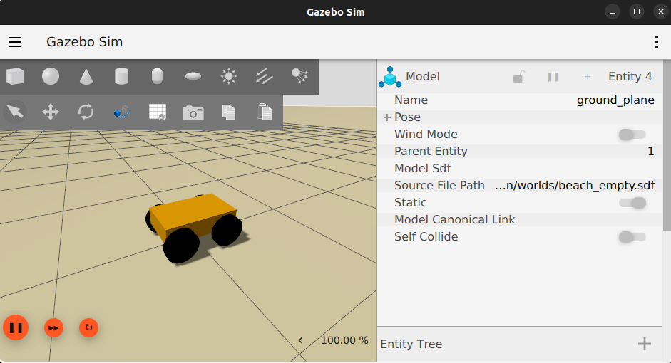

# Beach Waste Path Planning

Autonomous navigation stack for a beach waste collection robot. Built on ROS 2 Jazzy with Gazebo Harmonic simulation.



## Robot Platform

- **Chassis:** 0.60 × 0.35 × 0.15 m, ~20 kg
- **Drive:** 4 actuated wheels, differential drive (13 cm radius, 6 cm width)
- **Environment:** Beach / sand terrain (irregular surface)
- **Onboard compute:**
  - Raspberry Pi 5 (8 GB) — ROS 2 Jazzy navigation stack (Ubuntu 24.04)
  - Jetson Nano (original) — vision / AI waste detection
- **Primary sensors:** IMU + GPS
  - Wheel encoders are **not used for localization** — sand causes excessive slip and drift

## Localization: Two EKF Options

Both options fuse IMU + GPS to produce a filtered odometry estimate. They can be tested and compared independently.

| | Option A: Custom EKF | Option B: robot\_localization |
|---|---|---|
| Package | `beach_robot_custom_ekf` | `beach_robot_localization` |
| Implementation | Hand-written 5-state EKF in C++ | `robot_localization` ekf\_node + navsat\_transform\_node |
| State | \[x, y, theta, v, omega\] | Full 15-state (position, orientation, velocity, acceleration) |
| IMU handling | Accel/gyro as control inputs in process model | Configurable per-axis fusion |
| GPS handling | Equirectangular projection to local frame | navsat\_transform\_node (UTM conversion) |
| Tuning | Direct Q/R matrices in YAML | Per-sensor covariance config in YAML |
| Best for | Learning, full control over filter behavior | Production use, well-tested, handles edge cases |

## Prerequisites

### Host machine

- Ubuntu 22.04 (tested) or any Linux with Docker support
- Docker Engine and Docker Compose v2
- NVIDIA GPU + drivers

### NVIDIA Container Toolkit (required)

GPU passthrough is needed for Gazebo rendering. Install on the **host**:

```bash
# Add NVIDIA repo
curl -fsSL https://nvidia.github.io/libnvidia-container/gpgkey \
  | sudo gpg --dearmor -o /usr/share/keyrings/nvidia-container-toolkit-keyring.gpg

curl -s -L https://nvidia.github.io/libnvidia-container/stable/deb/nvidia-container-toolkit.list \
  | sed 's#deb https://#deb [signed-by=/usr/share/keyrings/nvidia-container-toolkit-keyring.gpg] https://#g' \
  | sudo tee /etc/apt/sources.list.d/nvidia-container-toolkit.list

# Install
sudo apt-get update
sudo apt-get install -y nvidia-container-toolkit

# Configure Docker runtime and restart
sudo nvidia-ctk runtime configure --runtime=docker
sudo systemctl restart docker
```

Verify with:

```bash
docker run --rm --runtime=nvidia --gpus all nvidia/cuda:12.0.0-base-ubuntu22.04 nvidia-smi
```

## Quick Start

```bash
# Clone / enter the project
cd beach_waste_path_planning

# Allow X11 forwarding for GUI tools
xhost +local:docker

# Build the Docker image (first time takes a few minutes)
cd docker
docker compose build

# Start the container
docker compose up -d

# Enter the container
docker compose exec ros2-dev bash
```

### Inside the container

```bash
# Build all packages
cd /ros2_ws
colcon build --symlink-install
source install/setup.bash

# Test Option A (custom EKF)
ros2 launch beach_robot_custom_ekf ekf_custom.launch.py

# Test Option B (robot_localization)
ros2 launch beach_robot_localization dual_ekf_navsat.launch.py
```

### Simulation (Gazebo Harmonic)

```bash
# Inside the container — sanity-check the URDF in RViz
ros2 launch beach_robot_description display.launch.py

# Spawn the robot in Gazebo Harmonic with IMU + GPS + DiffDrive
ros2 launch beach_robot_description gazebo.launch.py
```

Drive the robot from another terminal:

```bash
docker compose exec ros2-dev bash
ros2 topic pub -r 2 /cmd_vel geometry_msgs/msg/Twist '{linear: {x: 0.3}}'
```

### Teleoperation with a PS4 controller

The container ships with `joy` + `teleop_twist_joy` and a DualShock 4 config in
`src/beach_robot_description/config/joy_ps4.yaml`.

**On the host — pair the controller first:**

- **USB:** just plug it in. The kernel `hid-sony` driver registers it as `/dev/input/js0`.
- **Bluetooth:** pair once with `bluetoothctl`:
  ```bash
  bluetoothctl
  # > scan on
  # (hold PS + Share on the controller until the light bar flashes)
  # > pair XX:XX:XX:XX:XX:XX
  # > trust XX:XX:XX:XX:XX:XX
  # > connect XX:XX:XX:XX:XX:XX
  ```

Verify the controller is visible on the host:

```bash
ls /dev/input/js*          # should list js0
jstest /dev/input/js0      # optional: shows live axis/button values
```

`docker-compose.yml` bind-mounts `/dev/input` read-only, so the container picks
up the controller automatically — **no `docker compose restart` needed** when
you plug it in after the container is already running.

**Inside the container — run teleop:**

```bash
ros2 launch beach_robot_description teleop.launch.py
```

Default button map (edit `config/joy_ps4.yaml` to change):

| Control | Action |
|---|---|
| **L1** (hold) | Deadman — must be held to drive |
| **L1 + R1** (hold) | Turbo mode (higher speed) |
| Left stick Y | Linear velocity (forward / back) |
| Right stick X | Angular velocity (turn) |

Sensor topics use `BEST_EFFORT` QoS — echo them with:

```bash
ros2 topic echo /imu/data --qos-reliability best_effort
ros2 topic echo /gps/fix --qos-reliability best_effort
```

### Open additional terminals

```bash
# From the host, open more shells into the running container
cd beach_waste_path_planning/docker
docker compose exec ros2-dev bash
```

### GUI tools

All GUI tools render on the host display via X11 forwarding:

```bash
# Inside the container
rviz2 &
ros2 run plotjuggler plotjuggler &
gz sim &
```

### Stop the container

```bash
cd beach_waste_path_planning/docker
docker compose down
```

## Project Structure

```
beach_waste_path_planning/
├── docker/
│   ├── Dockerfile              # ROS 2 Jazzy + Gazebo Harmonic + dev tools
│   ├── docker-compose.yml      # NVIDIA GPU + X11 + volume mounts
│   └── entrypoint.sh           # Sources ROS 2 and workspace on entry
├── src/
│   ├── beach_robot_description/    # URDF + Gazebo Harmonic world + launch
│   │   ├── urdf/beach_robot.urdf.xacro
│   │   ├── urdf/gazebo.xacro
│   │   ├── worlds/beach_empty.sdf
│   │   ├── config/bridge.yaml
│   │   ├── config/joy_ps4.yaml         # PS4 teleop button/axis map
│   │   ├── launch/display.launch.py
│   │   ├── launch/gazebo.launch.py
│   │   └── launch/teleop.launch.py     # joy + teleop_twist_joy
│   ├── beach_robot_custom_ekf/     # Option A: custom EKF (C++)
│   │   ├── src/ekf_imu_gps.cpp
│   │   ├── config/ekf_params.yaml
│   │   └── launch/ekf_custom.launch.py
│   └── beach_robot_localization/   # Option B: robot_localization config
│       ├── config/ekf.yaml
│       ├── config/navsat.yaml
│       └── launch/dual_ekf_navsat.launch.py
├── public/images/readme/       # README assets
├── config/                     # Shared configuration files
├── scripts/                    # Utility scripts
├── .gitignore
├── .dockerignore
└── README.md
```

## Sensor Topics

| Topic | Type | Source (sim / real) | Used by |
|-------|------|---------------------|---------|
| `/imu/data` | `sensor_msgs/Imu` | `gz-sim-imu-system` (sim) / IMU driver (real) | Both EKF options |
| `/gps/fix` | `sensor_msgs/NavSatFix` | `gz-sim-navsat-system` (sim) / GPS driver (real) | Both EKF options |
| `/cmd_vel` | `geometry_msgs/Twist` | teleop / Nav2 | DiffDrive controller |
| `/odom` | `nav_msgs/Odometry` | `gz-sim-diff-drive-system` (sim) | Debug / comparison with EKF |
| `/odometry/filtered` | `nav_msgs/Odometry` | EKF output | Nav2, downstream consumers |
| `/odometry/gps` | `nav_msgs/Odometry` | navsat\_transform\_node | Option B only (internal) |

## Development Notes

- **Editing code:** edit files in `src/` and `config/` from your host IDE — they are bind-mounted into the container.
- **Build cache:** the colcon `build/`, `install/`, and `log/` directories live in Docker named volumes, so `colcon build` stays fast across container restarts.
- **UID mapping:** the container user matches host UID 1000 to avoid file permission issues on bind-mounted files.

### Rebuilding the image

Only needed when the **Dockerfile** or apt package list changes. For day-to-day
code changes, just `colcon build` inside the container.

**Default — small Dockerfile change (add/remove a package, tweak a RUN line):**

```bash
cd docker
docker compose down
docker compose build       # layer cache reuses unchanged layers — fast, minimal extra disk
docker compose up -d
```

**Occasional housekeeping — once disk gets tight (`docker system df`):**

```bash
docker image prune -af     # removes dangling <none>:<none> images
docker builder prune -af   # clears BuildKit cache
```

**Worst case — base image swap, `--no-cache` rebuild, or full disk causing apt
GPG errors (`At least one invalid signature was encountered`):**

```bash
cd docker
docker compose down
docker image rm beach_robot:jazzy    # release old layers
docker builder prune -af
docker image prune -af
df -h /                              # confirm ≥15 GB free before continuing
docker compose build
docker compose up -d
```

**Clear colcon cache** (separate from the Docker image, forces a fresh
`colcon build`):

```bash
docker volume rm docker_build_cache docker_install_cache docker_log_cache
```
